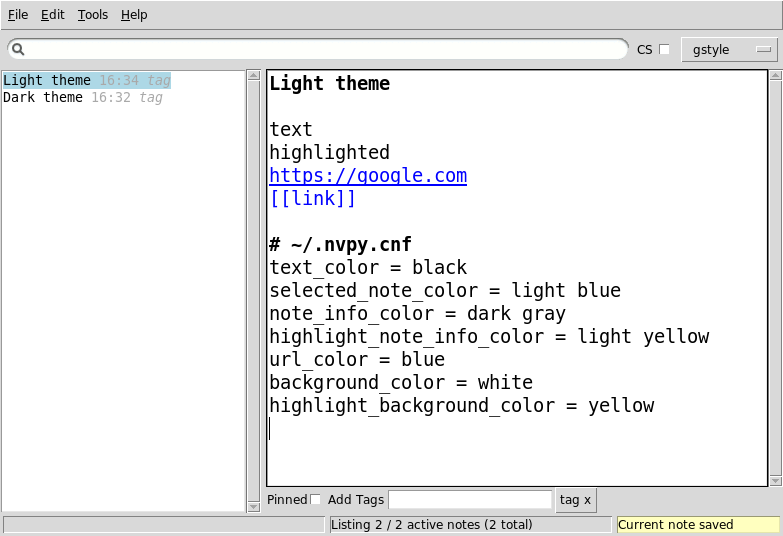
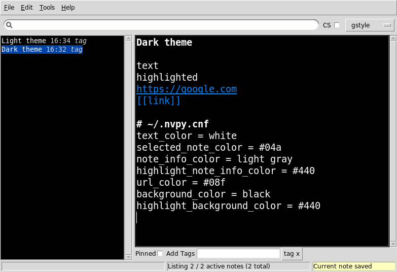

====
nvPY
====

nvpy is a simplenote-syncing note-taking tool inspired by Notational
Velocity (and a little bit by nvALT too) on OSX and ResophNotes on
Windows. It is significantly uglier, but it is cross-platform.  Yes,
you heard right, you can run this on Linux (tested), Windows (tested)
and OS X (lightly tested).

It was written by Charl Botha, who needed a simplenote client on Linux and doesn't mind ugliness (that much). Sjaak Westdijk has contributed significantly to the codebase since right after the 0.8.5 release.

* nvpy lives happily at https://github.com/cpbotha/nvpy
* For news and discussion, join the `public nvpy google group <https://groups.google.com/d/forum/nvpy>`_ or subscribe to its `RSS topic feed <https://groups.google.com/group/nvpy/feed/rss_v2_0_topics.xml>`_.

DISCLAIMER
==========
If nvpy blows up your computer, loses your job or just deletes all
your notes, I am NOT liable for anything. Also see the liability
clause at the end of the new BSD licence text in the COPYRIGHT file.

That being said, I use nvpy daily on my own precious notes database
and it hasn't disappointed me (yet).

Screenshots and screencasts
===========================

* Screenshot taken shortly before the 0.9.7 release (clam theme, droid font):

.. image:: https://lh3.googleusercontent.com/DvOXzSgUnzO_kUiKS8UdcF0F9DsF3v6MBRCiUMIT472FtSvlMGqU3AEr1XwT2ERmTQh5RcKraZvdtnnScWhtqZlQd-KQDnVwmbTtPWx8uWpAI1OJHsf0fhXlbB5rRnp2iakM7xwi1IO4_-CWno4LRIqsTf7g5Bvu6BogQshWeAYyZQlsn7i5vD7OqljS7UcEc9EcQy2WLao0uiWCB38RVWSaq4eWFWxJnxV_MaFV5fs9lTvkGC78pq9u2Z4-eTdjqzj6X-ZzLOPZTQZc7g-pyTkFIIa2_pZNUBW0-y1IqYJxM4eDLYcu6PPt4VlHPCN9rvkLN6xYUJLdaz0SIo8X9ezPLHvIuI41SiiIn1wZnrr9rfgFGocstzOMt-A5QzZ8gTkXuAHucrZdmg5Xe4upqvCZGztpc4bgwEyvx132Ua4Zk2utBUgLAh3rp3D1GR0J5R_-W0iBJsn2gsQaFGUJf4zB-bD6HszWkTJ7AAcV0TogR4CQE1757tcZIKPxdOPSwFuMGGq-xeIhHYyGa7dYE_xbkhqIeE3AIpJ7dRpTN5AxIlTzQg5WYF8TEw7pdu6P9YpYcw=w873-h470-no

* Screencast of nvpy's inter-note linking (May 27, 2012): http://youtu.be/NXuVMZr31SI
* Screencast of nvpy's gstyle search mode (October 18, 2012): http://youtu.be/dzILoLC5vRM
* `Picasa Web album containing various screenshots over time <https://picasaweb.google.com/102438662851504788261/NvpyPublic?authuser=0&feat=directlink>`_.

A note on automatic syncing
===========================

* When nvPY starts up, it automatically performs a full sync. When you start it up for the first time, this can take quite a while. On subsquent startups, it's much faster, as it maintains its own database on disk.
* While running, nvPY automatically and continuously saves and syncs any changes to disk and to simplenote. You don't have to do anything besides typing your notes.
* If you edit the same note simultaneously in nvPY and for example the web interface, these changes will be merged as you work.
* If you add or delete notes from a completely different location, nvPY will not pick this up until your next full sync. In the future, this will also happen automatically.
* In short: You usually don't have to worry about syncing and saving, simplenote takes care of this. If you have any more questions, please post them in the `nvpy google group <https://groups.google.com/d/forum/nvpy>`_.

Installation
============

See the `nvPY installation guide <https://github.com/cpbotha/nvpy/blob/master/docs/installation.rst>`_.

How to run for the first time
=============================

Create a file called .nvpy.cfg in your home directory that looks like
the following::

    [nvpy]
    sn_username = your_simplenote_username
    sn_password = your_simplenote_password

If you installed this via pip install, you should now be able to start
the application by typing "nvpy". The first time you run it, it will take
a while as it downloads all of your simplenote notes. Subsequent runs
are much faster as it uses the database it stores in your home directory.

If you prefer to run from your git clone, you can just invoke python on nvpy.py, or on the nvpy package directory.

The `example nvpy.cfg <https://github.com/cpbotha/nvpy/blob/master/nvpy/nvpy-example.cfg>`_ shows how you can configure the font 
family and size, the widget theme (!) configure nvpy to save and load notes as clear text, disable simplenote syncing, and so forth.

Making nvpy slightly less ugly on Linux
=======================================

On Linux, I set the nvpy ttk theme to ``clam`` (instead of ``default``; the example
config above has more information about themes), and I select nicer fonts. The
relevant config options are as follows::

    theme = clam
    font_family = droid sans mono
    font_size = 12
    list_font_size = 12

On Debian systems, you have to install the ``fonts-droid`` package to be able to
select the attractive ``droid sans mono`` font. ``ubuntu mono`` is also good and
should work out of the box on Ubuntu installations.

Let us know on the Google group if you have suggestions for further decreasing
the level of ugliness!

Theme Customization
===================

nvPY was prepared two themes.  You can apply it by editing `nvpy.cfg`.

**Light Theme**: ::

    # Colors (light theme)
    text_color = black
    selected_note_color = light blue
    note_info_color = dark gray
    highlight_note_info_color = light yellow
    url_color = blue
    background_color = white
    highlight_background_color = yellow

**Dark Theme**: ::

    # Colors (dark theme)
    text_color = white
    selected_note_color = #04a
    note_info_color = light gray
    highlight_note_info_color = #440
    url_color = #08f
    background_color = black
    highlight_background_color = #440

If you dont like it, it would be better to customize the theme as your like.
Let's change some options based on the above theme.
Options are accept 3 formats:

* Hex triplet format (#rrggbb)
* Shorthand hex triplet format (#rgb)
* Color names  (See `color names list <https://www.tcl.tk/man/tcl8.5/TkCmd/colors.htm>`_ and `color chart <https://wiki.tcl.tk/37701>`_)

Note: during customizing the theme we highly recommend setting ``simplenote_sync = 0`` to disable sync.
Because prevent reach the API rate limit by automatic full synchronization at startup.

Keyboard handling
=================

nvPY was designed for lightning-speed note-taking and management with
the keyboard. As you type words in the search bar, the list of notes
found will be refined. In the default search mode ("gstyle"), it finds
notes that contain all the words you enter. For example::

    t:work t:leads python imaging "exact phrase"

Will find all notes tagged with both "work" and "leads" containing the
words "python" and "imaging" (anywhere, and in any order) and the exact
phrase "exact phrase". The default is to search with case-sensitivity.
This can be changed with the CS checkbox. Remember though that
case-sensitivity has a significant effect on search speed.

By editing the config file, or by toggling the search mode option menu,
you can use regular expression search mode. This is of course much more
powerful, but is much slower than gstyle. The difference is noticeable
on large note collections.

Here's a summary of the different shortcut keys that you can use in nvPY:

============= ==========
Key combo     Action
============= ==========
Ctrl-?        Display these key-bindings.
Ctrl-A        Select all text when in the note editor.
Ctrl-C        Copy selected text into the clipboard. If no text is selected, copy the note title.
Ctrl-D        Move note to trash. This can be easily recovered using the simplenote webapp.
Ctrl-F        Start real-time incremental regular expression search. As you type, notes list is filtered. Up / down cursor keys go to previous / next note.
Ctrl-G        Edit tags for currently selected note. Press ESC to return to note editing.
Ctrl-J        Navigate (down) to next note in list. (VIM binding)
Ctrl-K        Navigate (up) to previous note in list. (VIM binding)
Ctrl-M        Render Markdown note to HTML and open browser window.
Ctrl-N        Create new note.
Ctrl-Q        Exit nvPY.
Ctrl-R        Render reStructuredText (reST) note to HTML and open browser window.
Ctrl-S        Force sync of current note with simplenote server. Saving to disc and syncing to server also happen continuously in the background.
Ctrl-Shift-S  Toggle a pinned button.
Ctrl-Y        Redo note edits.
Ctrl-Z        Undo note edits.
Ctrl-SPACE    In search box, autocomplete tag under cursor. Keep on pressing for more alternatives.
Ctrl-+/-      Increase or decrease the font size.
Ctrl-BS       Delete previous word in the note editor.
Ctrl-Delete   Delete next word in the note editor.
ESC           Go from edit mode to search box (and, optionally, in empty search box, exit nvPY).
Ctrl-[        Same as ESC. (VIM binding)
ENTER         Start editing currently selected note. If there's a search string but no notes in the list, ENTER creates a new note with that search string as its title.
============= ==========

Features
========

* Syncs with simplenote.
* Support for simplenote tags and note pinning.
* Partial syncs (whilst notes are being edited) are done by a
  background thread so you can keep on working at light speed.
* Can be used offline, also without simplenote account.
* Search box does realtime gstyle or regular expression searching in all your
  notes. All occurrences of the search string are also
  highlighted in currently active note.
* Markdown rendering to browser.
* Continuous rendering mode: If you activate this before
  starting the markdown rendering, nvpy will render new html of
  the currently open note every few seconds. Due to the refresh
  tag in the generated HTML, the browser will refresh every few
  seconds. MAGIC UPDATES!
* reStructuredText (reST) rendering to browser. Yes, you can use nvPY
  as your reST previewer.
* Automatic hyperlink highlighting in text widget.
* KickAss(tm) inter-note linking with [[note name]]. If note name is
  not found in current list of notes, assumes it's a regular expression
  and sets it in the search bar. See the `screencast <http://youtu.be/NXuVMZr31SI>`_.

Planned features
================

* sqlite storage backend.
* Full(ish) screen mode.
* Prettiness.

Bugs and feedback
=================

* Report bugs with `the github issue tracker <https://github.com/cpbotha/nvpy/issues>`_.
* It's an even better idea to clone, fix and then send me a pull request.
* If you have questions, or would like to discuss nvpy-related matters, please do so via the `nvpy google discussion group / mailing list <https://groups.google.com/d/forum/nvpy>`_.
* If you really like nvpy, you could make me and you even happier by `tipping me with paypal <https://www.paypal.com/cgi-bin/webscr?cmd=_s-xclick&hosted_button_id=BXXTJ9E97DG52>`_! 

Credits
=======

* Sjaak Westdijk made significant contributions to the code starting after the 0.8.5 release.
* nvpy uses the `fantastic simplenote.py library by mrtazz <https://github.com/mrtazz/simplenote.py>`_.
* The brilliant application icon, a blue mini car (not as fast as the notational velocity rocket, get it?), is by `Cemagraphics <http://cemagraphics.deviantart.com/>`_.
* Thank you very much peeps for the PayPal tips!
  * stfa
  * https://github.com/gudnm
  * stephen powell
  * Robert Munger
  * Jordan McCommons
  * Jan Steinocher
  * T Anderson

Running Tests
=============

Run the following command. ::

    make test

NOTE: While test cases are running, the nvpy window is displayed many times.  It will impede your work.
